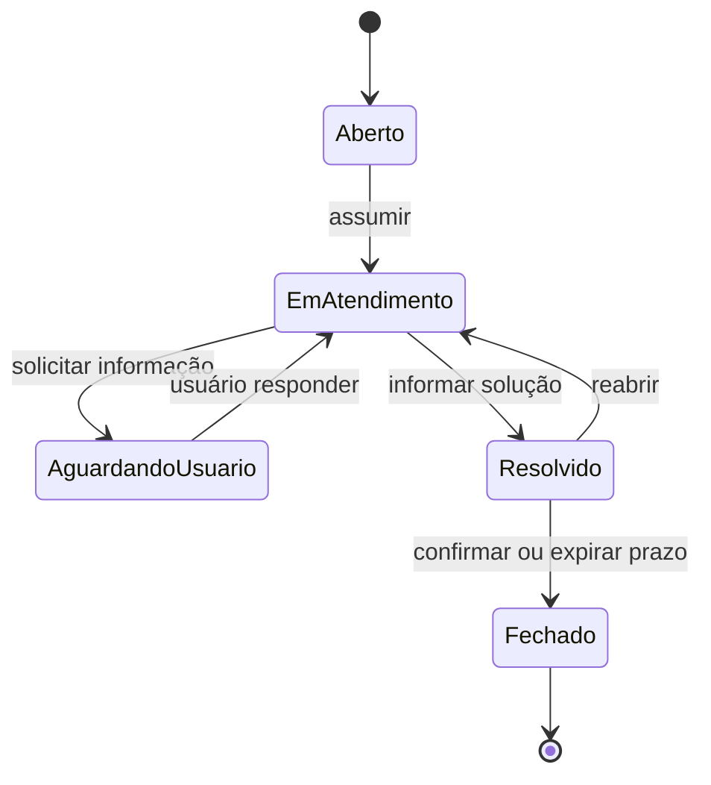
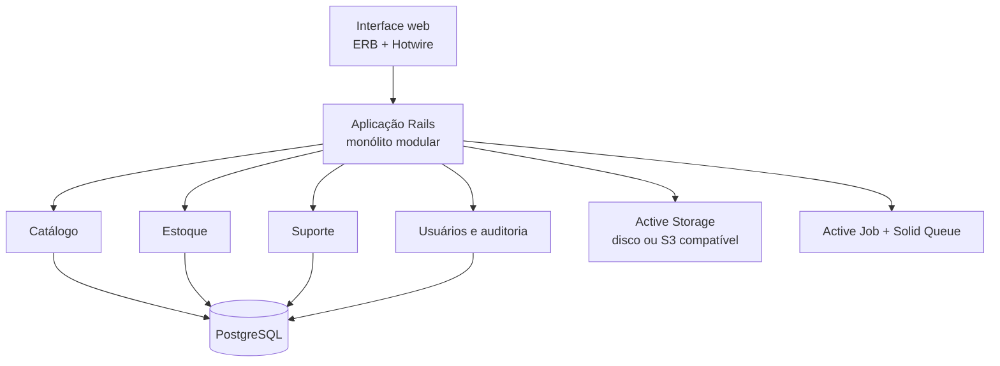
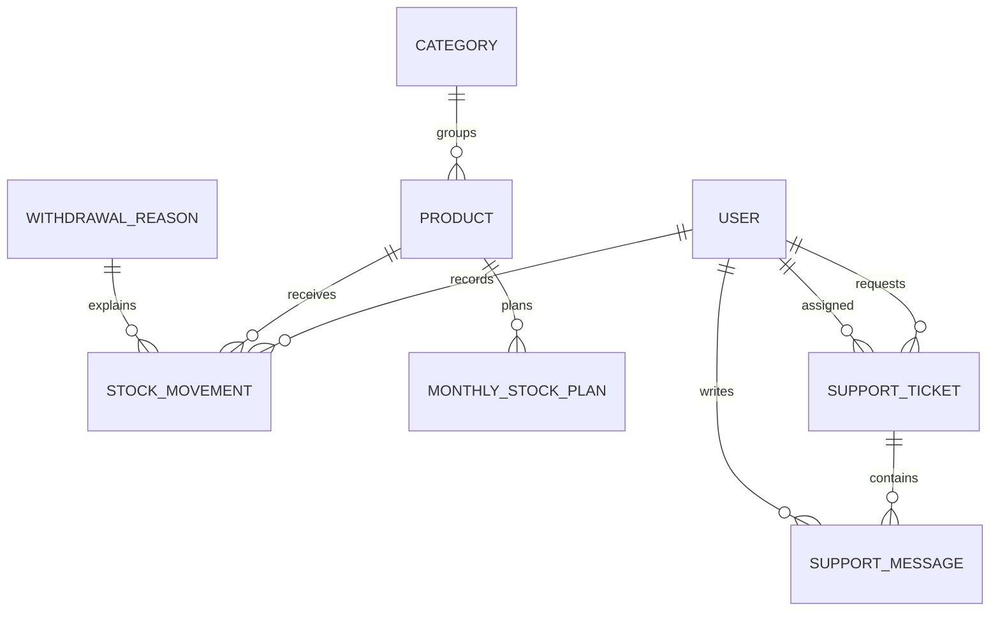
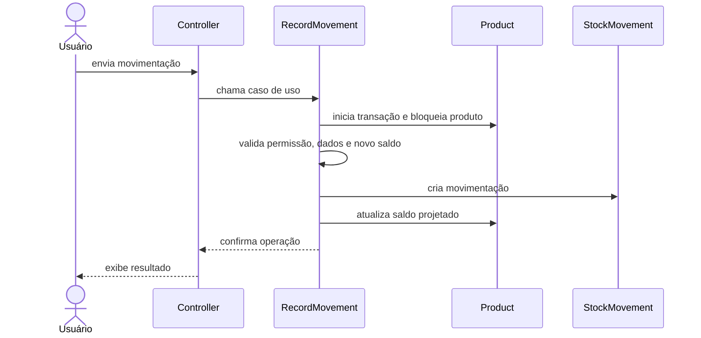

# Sistema de Almoxarifado e Central de Suporte

## Especificação de requisitos, arquitetura, tecnologias, metodologia e plano de estudos

| Informação | Valor |
| --- | --- |
| Versão do documento | 1.0 |
| Data | 28/08/2026 |
| Status | Proposta inicial para validação |
| Tipo de projeto | Aplicação web para portfólio e possível validação como produto |
| Arquitetura recomendada | Monólito modular em Ruby on Rails |

---

## 1. Visão do projeto

O projeto consiste em uma aplicação web para controle de almoxarifado, movimentações de estoque, planejamento de consumo, gastos e atendimento de chamados internos.

O sistema deverá responder com segurança a cinco perguntas principais:

1. Quais produtos estão disponíveis e em qual quantidade?
2. Quem realizou cada entrada, retirada ou ajuste?
3. Quanto foi comprado e gasto em determinado período?
4. O consumo está dentro do planejado e quais itens precisam de reposição?
5. Quais problemas foram comunicados pelos usuários e como foram atendidos?

O diferencial do projeto não será apenas cadastrar produtos. Ele terá regras de negócio, histórico imutável de movimentações, controle de acesso, tratamento de concorrência, relatórios, anexos, auditoria e testes automatizados.

### 1.1 Objetivo geral

Centralizar o controle operacional e financeiro de um almoxarifado, oferecendo rastreabilidade das movimentações e um canal organizado de suporte aos usuários.

### 1.2 Objetivos específicos

- Cadastrar produtos e categorias;
- Registrar entradas, retiradas, ajustes e estornos;
- Impedir estoque negativo;
- Identificar o usuário responsável por cada operação;
- Preservar o histórico para auditoria;
- Alertar sobre itens abaixo do estoque mínimo;
- Comparar consumo real com planejamento mensal;
- Apurar quantidades e valores por produto, categoria e período;
- Controlar usuários, papéis e permissões;
- Permitir abertura e acompanhamento de chamados;
- Disponibilizar uma fila de atendimento para a equipe de suporte;
- Manter o projeto testável, documentado e executável com Docker.

### 1.3 Princípios do produto

- Toda mudança de estoque gera uma movimentação identificável;
- Movimentações confirmadas não são apagadas: erros são corrigidos por estorno;
- Regras críticas são validadas no backend e, quando possível, também no banco;
- O acesso é negado por padrão e liberado conforme o papel do usuário;
- O MVP deve ser simples de operar, desenvolver e demonstrar;
- Funcionalidades futuras não devem aumentar a complexidade antes de existir necessidade real.

---

## 2. Escopo

### 2.1 Escopo do MVP

O MVP será considerado funcional quando possuir:

- Autenticação de usuários;
- Papéis de requerente, almoxarifado, suporte e administrador;
- Cadastro de categorias e produtos;
- Foto opcional do produto;
- Registro de entradas com quantidade, preço unitário, data e responsável;
- Registro de retiradas com quantidade, motivo, data e responsável;
- Ajustes e estornos rastreáveis;
- Histórico completo por produto e por usuário;
- Bloqueio de retirada superior ao saldo disponível;
- Estoque mínimo e painel de itens que precisam de reposição;
- Planejamento mensal de consumo;
- Relatórios operacionais e financeiros básicos;
- Abertura e acompanhamento de chamados;
- Fila de atendimento, atribuição, mensagens e estados do chamado;
- Auditoria das operações críticas;
- Testes automatizados dos fluxos principais;
- Ambiente local com Docker Compose e integração contínua.

### 2.2 Fora do MVP

As funcionalidades abaixo são úteis, mas ficam no backlog de evolução:

- Múltiplos almoxarifados e endereçamento físico;
- Cadastro de fornecedores e ordens de compra;
- Aprovação de solicitações antes da retirada;
- Reserva de itens;
- Controle por lote, número de série ou validade;
- Leitura de código de barras ou QR Code;
- Importação em massa por planilha;
- Exportação avançada para PDF e Excel;
- Notificações por e-mail, WhatsApp ou aplicativo;
- Aplicativo móvel nativo;
- API pública para integrações;
- Previsão de demanda com inteligência artificial;
- Arquitetura de microsserviços;
- Multiempresa ou multi-tenant.

Manter esses itens fora do MVP é uma decisão de foco, não uma limitação permanente.

---

## 3. Perfis de usuário e permissões

O MVP terá um papel principal por usuário. Caso uma pessoa precise acumular vários papéis no futuro, o campo poderá evoluir para tabelas de papéis e atribuições.

| Ação | Requerente | Almoxarifado | Suporte | Admin |
| --- | :---: | :---: | :---: | :---: |
| Consultar catálogo | Sim | Sim | Sim | Sim |
| Consultar suas retiradas | Sim | Sim | Sim | Sim |
| Registrar entrada | Não | Sim | Não | Sim |
| Registrar retirada | Conforme fluxo definido | Sim | Não | Sim |
| Ajustar ou estornar movimentação | Não | Sim | Não | Sim |
| Gerenciar produtos e categorias | Não | Sim | Não | Sim |
| Consultar relatórios de estoque | Não | Sim | Não | Sim |
| Abrir e acompanhar seus chamados | Sim | Sim | Sim | Sim |
| Atender chamados | Não | Não | Sim | Sim |
| Ver observações internas do suporte | Não | Não | Sim | Sim |
| Gerenciar usuários e configurações | Não | Não | Não | Sim |
| Consultar auditoria completa | Não | Opcional | Não | Sim |

### 3.1 Requerente

- Consulta produtos ativos;
- Solicita ou registra retirada, conforme a política adotada;
- Consulta suas próprias retiradas;
- Abre chamados;
- Anexa arquivos aos chamados;
- Responde e acompanha seus chamados.

### 3.2 Almoxarifado

- Gerencia produtos, categorias e motivos;
- Registra entradas, retiradas, ajustes e estornos;
- Consulta histórico, alertas, planejamento e relatórios;
- Não gerencia usuários, salvo permissão futura específica.

### 3.3 Suporte

- Visualiza a fila de chamados;
- Assume, transfere, responde e encerra atendimentos;
- Registra observações internas;
- Não altera estoque por possuir o papel de suporte.

### 3.4 Administrador

- Gerencia usuários e configurações;
- Possui acesso administrativo a todos os módulos;
- Consulta a trilha completa de auditoria;
- Não pode apagar rastros de movimentações confirmadas.

---

## 4. Requisitos funcionais

### 4.1 Catálogo de produtos

| ID | Requisito |
| --- | --- |
| RF-CAT-001 | O sistema deve permitir cadastrar, visualizar, editar e inativar categorias. |
| RF-CAT-002 | O sistema deve permitir cadastrar, visualizar, editar e inativar produtos. |
| RF-CAT-003 | Cada produto deve possuir código único, nome, descrição opcional, categoria, unidade de medida, estoque mínimo e estado ativo/inativo. |
| RF-CAT-004 | O sistema deve permitir anexar uma foto opcional ao produto. |
| RF-CAT-005 | O sistema deve permitir pesquisar produtos por nome ou código e filtrar por categoria e situação. |
| RF-CAT-006 | Produtos que possuem histórico não devem ser excluídos fisicamente; devem ser inativados. |

### 4.2 Movimentações de estoque

| ID | Requisito |
| --- | --- |
| RF-EST-001 | O sistema deve registrar entradas de estoque com produto, quantidade, preço unitário, data da compra, responsável e observação opcional. |
| RF-EST-002 | O sistema deve registrar retiradas com produto, quantidade, data, responsável, motivo e observação opcional. |
| RF-EST-003 | Ao selecionar o motivo “Outro”, o usuário deve informar um motivo personalizado. |
| RF-EST-004 | O sistema deve permitir ajustes de inventário com justificativa obrigatória. |
| RF-EST-005 | O sistema deve permitir estornar uma movimentação confirmada sem apagar o registro original. |
| RF-EST-006 | O sistema deve apresentar o saldo atual do produto. |
| RF-EST-007 | O sistema deve impedir retiradas e ajustes de saída que deixem o saldo negativo. |
| RF-EST-008 | O sistema deve exibir o histórico cronológico de cada produto. |
| RF-EST-009 | O sistema deve permitir filtrar o histórico por período, produto, tipo e usuário. |
| RF-EST-010 | O sistema deve registrar data, horário e usuário em toda movimentação. |

### 4.3 Motivos de retirada

| ID | Requisito |
| --- | --- |
| RF-MOT-001 | O administrador ou almoxarifado deve poder cadastrar e inativar motivos de retirada. |
| RF-MOT-002 | O nome do motivo deve ser único entre os motivos ativos. |
| RF-MOT-003 | O sistema deve manter o motivo associado a movimentações antigas mesmo após sua inativação. |
| RF-MOT-004 | Deve existir a opção “Outro”, que exige justificativa textual no backend. |

### 4.4 Estoque mínimo e planejamento

| ID | Requisito |
| --- | --- |
| RF-PLA-001 | Cada produto deve possuir uma quantidade mínima configurável. |
| RF-PLA-002 | O painel deve destacar produtos cujo saldo seja menor ou igual ao estoque mínimo. |
| RF-PLA-003 | O sistema deve permitir definir o consumo planejado de cada produto por competência mensal. |
| RF-PLA-004 | Deve existir no máximo um planejamento por produto e competência. |
| RF-PLA-005 | O sistema deve comparar consumo planejado e consumo realizado no mês. |
| RF-PLA-006 | O sistema deve mostrar quantidade planejada, consumida, restante e percentual utilizado. |

### 4.5 Relatórios

| ID | Requisito |
| --- | --- |
| RF-REL-001 | O sistema deve informar a quantidade comprada por período. |
| RF-REL-002 | O sistema deve informar a quantidade retirada por período. |
| RF-REL-003 | O sistema deve calcular o gasto por produto, categoria e competência. |
| RF-REL-004 | O sistema deve calcular o gasto total mensal. |
| RF-REL-005 | O sistema deve listar produtos de maior consumo. |
| RF-REL-006 | O sistema deve listar produtos abaixo do estoque mínimo. |
| RF-REL-007 | O sistema deve permitir detalhar as movimentações que originaram cada total apresentado. |

### 4.6 Usuários, autenticação e autorização

| ID | Requisito |
| --- | --- |
| RF-USU-001 | O sistema deve exigir autenticação para acessar as áreas internas. |
| RF-USU-002 | O sistema deve permitir recuperação segura de senha. |
| RF-USU-003 | O administrador deve poder cadastrar, editar, ativar e inativar usuários. |
| RF-USU-004 | Cada usuário deve possuir nome, e-mail único, papel e situação. |
| RF-USU-005 | Toda ação protegida deve verificar a autorização no backend. |
| RF-USU-006 | A inativação do usuário não deve remover seu histórico. |

### 4.7 Central de suporte

| ID | Requisito |
| --- | --- |
| RF-SUP-001 | O usuário autenticado deve poder abrir um chamado com assunto, categoria, descrição e prioridade inicial permitida. |
| RF-SUP-002 | O requerente deve poder anexar arquivos e imagens permitidos. |
| RF-SUP-003 | O requerente deve visualizar somente seus chamados, salvo se possuir permissão administrativa. |
| RF-SUP-004 | O suporte deve visualizar filas de chamados não atribuídos, atribuídos a si e aguardando resposta. |
| RF-SUP-005 | O suporte deve poder assumir ou transferir um chamado. |
| RF-SUP-006 | Requerente e suporte devem poder trocar mensagens no chamado. |
| RF-SUP-007 | O suporte deve poder criar observações internas invisíveis ao requerente. |
| RF-SUP-008 | O sistema deve registrar todas as alterações de responsável, prioridade e estado. |
| RF-SUP-009 | O suporte deve poder marcar o chamado como resolvido. |
| RF-SUP-010 | O chamado deve poder ser fechado conforme a regra de transição definida. |
| RF-SUP-011 | O sistema deve exibir uma linha do tempo com mensagens e eventos do chamado. |

### 4.8 Auditoria

| ID | Requisito |
| --- | --- |
| RF-AUD-001 | O sistema deve registrar o ator, a ação, o registro afetado e o instante das operações críticas. |
| RF-AUD-002 | Para alterações, o sistema deve registrar os valores relevantes anteriores e posteriores. |
| RF-AUD-003 | O histórico de auditoria deve ser somente leitura na interface. |
| RF-AUD-004 | O sistema deve registrar, quando disponível e adequado, IP e identificador da requisição. |
| RF-AUD-005 | Somente usuários autorizados devem consultar a auditoria completa. |

---

## 5. Regras de negócio

| ID | Regra |
| --- | --- |
| RN-001 | O preço não pertence ao produto. Cada entrada registra o preço pago naquela compra. |
| RN-002 | O total de uma entrada é calculado por quantidade multiplicada pelo preço unitário; não deve ser digitado separadamente. |
| RN-003 | A quantidade de uma movimentação deve ser diferente de zero e respeitar a direção do seu tipo. |
| RN-004 | O saldo do produto nunca pode ficar negativo. |
| RN-005 | A atualização do saldo e a criação da movimentação devem ocorrer na mesma transação de banco de dados. |
| RN-006 | O produto deve ser bloqueado durante a gravação de uma movimentação para evitar duas retiradas concorrentes sobre o mesmo saldo. |
| RN-007 | O saldo exibido no produto é uma projeção do livro de movimentações e nunca pode ser alterado diretamente por um CRUD comum. |
| RN-008 | Uma rotina de conferência deve conseguir comparar o saldo armazenado com a soma das movimentações. |
| RN-009 | Movimentações confirmadas não são editadas nem excluídas; correções são feitas por estorno e nova movimentação. |
| RN-010 | O estorno deve referenciar a movimentação original e só pode ocorrer uma vez. |
| RN-011 | Entrada exige preço unitário não negativo e data da compra. |
| RN-012 | Retirada exige um motivo ativo. Se o motivo for “Outro”, a justificativa personalizada é obrigatória. |
| RN-013 | Ajustes exigem justificativa e permissão apropriada. |
| RN-014 | Datas são armazenadas em UTC e exibidas no fuso configurado para a organização. |
| RN-015 | A competência do planejamento é representada pelo primeiro dia do mês e deve ser única por produto. |
| RN-016 | Produto, categoria, motivo ou usuário com histórico deve ser inativado, não apagado. |
| RN-017 | O requerente não pode visualizar observações internas do suporte. |
| RN-018 | Apenas chamados abertos ou em atendimento podem ser assumidos. |
| RN-019 | Um chamado resolvido pode ser reaberto antes do fechamento, conforme permissão definida. |
| RN-020 | Toda autorização deve existir no servidor, mesmo que a interface esconda o botão. |

### 5.1 Estados do chamado

Não será permitida alteração livre de qualquer estado para qualquer outro. As transições serão centralizadas em uma regra de domínio e testadas.

---

## 6. Requisitos não funcionais

| ID | Categoria | Requisito |
| --- | --- | --- |
| RNF-001 | Segurança | Senhas devem ser armazenadas com hash seguro provido pelo mecanismo de autenticação do Rails. |
| RNF-002 | Segurança | O sistema deve manter proteção contra CSRF, XSS, SQL injection e sessões indevidas, seguindo os padrões do Rails. |
| RNF-003 | Segurança | Segredos não podem ser versionados; devem ser fornecidos por credenciais protegidas ou variáveis de ambiente. |
| RNF-004 | Segurança | Dependências e código devem ser verificados automaticamente por ferramentas de segurança. |
| RNF-005 | Integridade | Regras críticas devem possuir validações Rails e constraints no PostgreSQL sempre que aplicável. |
| RNF-006 | Concorrência | Movimentações simultâneas não podem produzir saldo negativo ou perda de atualização. |
| RNF-007 | Desempenho | Listagens devem utilizar paginação e índices adequados aos filtros utilizados. |
| RNF-008 | Usabilidade | Mensagens de validação devem indicar o problema e como corrigi-lo. |
| RNF-009 | Acessibilidade | Formulários devem possuir labels, navegação por teclado e contraste adequado. |
| RNF-010 | Responsividade | As telas principais devem funcionar em desktop e celular. |
| RNF-011 | Manutenibilidade | Regras de negócio críticas devem ficar em objetos de domínio/serviço, não espalhadas em controllers e callbacks. |
| RNF-012 | Testabilidade | Fluxos críticos devem possuir testes automatizados executados na integração contínua. |
| RNF-013 | Observabilidade | Erros devem possuir logs estruturados e identificador de requisição. |
| RNF-014 | Recuperação | O ambiente de produção deve possuir backup do banco e teste periódico de restauração. |
| RNF-015 | Privacidade | O sistema deve coletar apenas dados pessoais necessários e restringir o acesso a logs e históricos. |
| RNF-016 | Portabilidade | O projeto deve ser executável de forma reproduzível com Docker Compose. |
| RNF-017 | Compatibilidade | O sistema terá suporte inicial às versões atuais de Chrome, Firefox e Edge. |

### 6.1 Metas iniciais mensuráveis

- Nenhuma operação crítica sem identificação do usuário;
- Nenhum saldo negativo, inclusive em teste concorrente;
- Tempo de resposta de até 2 segundos para 95% das páginas comuns em ambiente de produção do MVP;
- Paginação em históricos e filas;
- Cobertura obrigatória dos fluxos críticos, independentemente do percentual global;
- CI aprovada antes de integrar alterações à branch principal;
- Backup automatizado antes da disponibilização para usuários reais.

---

## 7. Arquitetura proposta

### 7.1 Estilo arquitetural

Será utilizado um **monólito modular em Ruby on Rails**.

O sistema será uma única aplicação e um único deploy, mas o código será organizado por módulos de negócio. Essa abordagem entrega transações simples, desenvolvimento rápido e baixo custo operacional, sem impedir uma separação futura caso algum módulo realmente precise escalar de forma independente.

### 7.2 Camadas lógicas

| Camada | Responsabilidade | Exemplos |
| --- | --- | --- |
| Apresentação | Receber ações e renderizar respostas | Controllers, views, Turbo Frames, Stimulus |
| Aplicação | Orquestrar casos de uso e transações | `Inventory::RecordMovement`, `Tickets::Assign` |
| Domínio | Representar entidades e regras locais | Product, StockMovement, SupportTicket, policies |
| Persistência | Consultar e garantir integridade dos dados | Active Record, PostgreSQL, constraints e índices |
| Infraestrutura | Arquivos, jobs, e-mail, logs e deploy | Active Storage, Solid Queue, Action Mailer, Docker |

Controllers devem ser pequenos. Operações que alteram estoque ou estado de chamado devem passar por serviços de aplicação com uma interface clara.

### 7.3 Módulos internos

- **Identity:** usuários, sessões, recuperação de senha, papéis e policies;
- **Catalog:** categorias, produtos, unidades e fotos;
- **Inventory:** movimentações, motivos, saldos, estornos e alertas;
- **Planning:** planejamento mensal e comparação de consumo;
- **Reporting:** consultas agregadas operacionais e financeiras;
- **Support:** chamados, mensagens, fila, atribuição e transições;
- **Audit:** eventos de auditoria e consulta administrativa.

### 7.4 Padrões adotados

- MVC para o fluxo web;
- Service objects para casos de uso transacionais;
- Policies para autorização;
- Query objects para relatórios complexos;
- Form objects apenas quando um formulário envolver múltiplos modelos ou regras extensas;
- Jobs para processamento que não precisa concluir durante a requisição;
- Active Storage para anexos;
- Constraints, foreign keys e índices para integridade no banco;
- ADRs curtos para registrar decisões arquiteturais importantes.

### 7.5 Padrões que não serão adotados inicialmente

- Microsserviços;
- Event sourcing completo;
- CQRS formal;
- Repository pattern sobre o Active Record;
- API separada para a própria interface web;
- React, Vue ou outro SPA sem requisito que justifique a complexidade;
- Redis apenas “porque projetos grandes usam”.

---

## 8. Tecnologias escolhidas

As versões de patch devem ser fixadas no início do projeto e atualizadas de forma controlada.

| Área | Tecnologia | Decisão |
| --- | --- | --- |
| Linguagem | Ruby 3.4.x | Linha em manutenção normal e ecossistema maduro; fixar o patch disponível no início do projeto. |
| Framework | Ruby on Rails 8.1.x | Framework principal, usando seus componentes nativos antes de adicionar dependências. |
| Banco | PostgreSQL 18.x | Banco relacional com transações, locks, constraints, índices e bons recursos de agregação. |
| Interface | ERB + Hotwire (Turbo e Stimulus) | Interface server-rendered, interativa e coerente com Rails. |
| Estilos | Tailwind CSS via integração Rails | Produtividade para uma interface responsiva; limitar a um design system pequeno. |
| Autenticação | Gerador nativo de autenticação do Rails | Sessão e recuperação de senha sem depender inicialmente de uma solução maior. |
| Autorização | Pundit | Policies explícitas por recurso e ação. |
| Arquivos | Active Storage | Fotos de produtos e anexos dos chamados. |
| Jobs | Active Job + Solid Queue | Filas persistentes sem exigir Redis no MVP. |
| Testes | RSpec + FactoryBot + Capybara | Testes de modelo, serviços, requisições e fluxos do navegador. |
| Qualidade | RuboCop Rails Omakase | Padronização estática do código Ruby. |
| Segurança | Brakeman + bundler-audit | Análise de vulnerabilidades na aplicação e dependências. |
| Ambiente | Docker + Docker Compose | Aplicação e PostgreSQL reproduzíveis entre os integrantes. |
| Versionamento | Git + GitHub ou GitLab | Issues, merge requests/pull requests e revisão de código. |
| CI | GitHub Actions ou GitLab CI | Testes, lint, auditoria e análise de segurança a cada alteração. |
| Deploy | Container Docker; PaaS ou Kamal na etapa final | A escolha do provedor será feita somente quando o MVP estiver pronto. |
| Documentação | Markdown + Mermaid | Requisitos, decisões, diagramas e instruções versionadas junto ao código. |

### 8.1 Por que não usar Ruby 4.0 imediatamente?

Ruby 4.0 é uma versão estável e em manutenção normal, porém a linha 3.4 também permanece em manutenção normal e tende a oferecer uma experiência mais previsível com gems, imagens e materiais existentes. Para um projeto de aprendizado, estabilidade do ambiente é mais valiosa do que usar a versão principal mais recente. A atualização poderá ser feita depois com testes automatizados.

### 8.2 Por que PostgreSQL 18?

É uma versão estável com suporte oficial previsto até 2030. O projeto usará recursos fundamentais e transferíveis para outras versões: chaves estrangeiras, `NOT NULL`, `CHECK`, `UNIQUE`, índices, transações, agregações e bloqueio de linhas.

### 8.3 Por que Hotwire em vez de uma SPA?

O sistema é majoritariamente composto por formulários, tabelas, filtros, painéis e alterações de estado. Hotwire atende a essa interação mantendo uma aplicação única, reduzindo duplicação de validações, autenticação e contratos de API.

---

## 9. Modelo de dados inicial

### 9.1 Relacionamentos principais

### 9.2 Entidades

#### User

| Campo | Tipo sugerido | Observação |
| --- | --- | --- |
| name | string | Obrigatório |
| email_address | string | Obrigatório, único e normalizado |
| password_digest | string | Gerenciado pela autenticação |
| role | enum/string | requester, warehouse, support ou admin |
| active | boolean | Padrão verdadeiro |
| last_login_at | datetime | Opcional |
| timestamps | datetime | Criação e atualização |

#### Category

| Campo | Tipo sugerido | Observação |
| --- | --- | --- |
| name | string | Único entre registros ativos |
| description | text | Opcional |
| active | boolean | Padrão verdadeiro |
| timestamps | datetime | Criação e atualização |

#### Product

| Campo | Tipo sugerido | Observação |
| --- | --- | --- |
| category_id | foreign key | Obrigatório e indexado |
| code | string | Obrigatório e único |
| name | string | Obrigatório |
| description | text | Opcional |
| unit_of_measure | string/enum | unit, box, package, ream, kg, liter etc. |
| current_quantity | decimal(14,3) | Saldo projetado; nunca editado diretamente |
| minimum_quantity | decimal(14,3) | Maior ou igual a zero |
| active | boolean | Padrão verdadeiro |
| lock_version | integer | Proteção adicional contra atualizações concorrentes |
| timestamps | datetime | Criação e atualização |

A foto será associada por `has_one_attached :photo`; o arquivo não será armazenado como uma coluna binária em `products`.

#### StockMovement

| Campo | Tipo sugerido | Observação |
| --- | --- | --- |
| product_id | foreign key | Obrigatório e indexado |
| user_id | foreign key | Ator responsável, obrigatório |
| withdrawal_reason_id | foreign key | Obrigatório para retirada |
| reversed_movement_id | foreign key | Referência opcional à movimentação original |
| movement_type | enum/string | entry, withdrawal, adjustment ou reversal |
| quantity_delta | decimal(14,3) | Positivo para entrada; negativo para saída |
| unit_price | decimal(12,2) | Obrigatório na entrada; nulo nas retiradas |
| custom_reason | text | Obrigatório quando o motivo for “Outro” |
| observation | text | Opcional |
| occurred_at | datetime | Momento efetivo da operação |
| created_at | datetime | Momento do registro no sistema |

O valor total não precisa ser persistido: `abs(quantity_delta) * unit_price` é calculado a partir dos dados da entrada. Isso evita divergência entre preço unitário, quantidade e total.

#### WithdrawalReason

| Campo | Tipo sugerido | Observação |
| --- | --- | --- |
| name | string | Obrigatório |
| requires_custom_reason | boolean | Verdadeiro para “Outro” |
| active | boolean | Inativação preserva histórico |
| timestamps | datetime | Criação e atualização |

#### MonthlyStockPlan

| Campo | Tipo sugerido | Observação |
| --- | --- | --- |
| product_id | foreign key | Obrigatório |
| reference_month | date | Sempre normalizado para o primeiro dia do mês |
| planned_consumption_quantity | decimal(14,3) | Maior ou igual a zero |
| created_by_id | foreign key | Usuário responsável |
| timestamps | datetime | Criação e atualização |

Deve existir um índice único em `product_id` e `reference_month`.

#### SupportCategory

| Campo | Tipo sugerido | Observação |
| --- | --- | --- |
| name | string | Obrigatório e único entre ativos |
| active | boolean | Padrão verdadeiro |
| timestamps | datetime | Criação e atualização |

#### SupportTicket

| Campo | Tipo sugerido | Observação |
| --- | --- | --- |
| requester_id | foreign key de User | Obrigatório |
| assignee_id | foreign key de User | Opcional enquanto não atribuído |
| support_category_id | foreign key | Obrigatório |
| subject | string | Obrigatório |
| description | text | Obrigatório; mensagem inicial |
| status | enum/string | open, in_progress, waiting_user, resolved, closed |
| priority | enum/string | low, normal, high, urgent |
| resolved_at | datetime | Preenchido ao resolver |
| closed_at | datetime | Preenchido ao fechar |
| timestamps | datetime | Criação e atualização |

#### SupportMessage

| Campo | Tipo sugerido | Observação |
| --- | --- | --- |
| support_ticket_id | foreign key | Obrigatório |
| author_id | foreign key de User | Obrigatório |
| body | text | Obrigatório |
| internal | boolean | Se verdadeiro, invisível ao requerente |
| created_at | datetime | Momento da mensagem |

Anexos poderão ser ligados à mensagem por `has_many_attached :attachments`.

#### AuditEvent

| Campo | Tipo sugerido | Observação |
| --- | --- | --- |
| actor_id | foreign key de User | Opcional somente para ações automáticas |
| auditable_type/auditable_id | referência polimórfica | Registro afetado |
| action | string | create, update, inactivate, assign, resolve etc. |
| changes | jsonb | Alterações relevantes |
| request_id | string | Correlação com logs |
| ip_address | inet/string | Quando apropriado |
| created_at | datetime | Evento imutável |

### 9.3 Índices e constraints indispensáveis

- `users.email_address`: unique;
- `products.code`: unique;
- Todas as foreign keys: índice;
- `stock_movements(product_id, occurred_at)`;
- `stock_movements(user_id, occurred_at)`;
- `monthly_stock_plans(product_id, reference_month)`: unique;
- `support_tickets(status, assignee_id, created_at)`;
- `support_messages(support_ticket_id, created_at)`;
- `audit_events(auditable_type, auditable_id, created_at)`;
- Checks para quantidades, preço não negativo e saldo não negativo;
- `NOT NULL` nos campos obrigatórios;
- Foreign keys com estratégia de exclusão restritiva para preservar histórico.

---

## 10. Operação crítica de estoque

O caso de uso para registrar uma movimentação seguirá esta sequência:

Se qualquer etapa falhar, toda a transação deve ser revertida. O bloqueio da linha do produto evita que duas requisições leiam o mesmo saldo e confirmem retiradas incompatíveis.

Exemplo de cenário que deverá possuir teste:

- Saldo inicial: 5 unidades;
- Usuário A tenta retirar 4;
- Usuário B tenta retirar 3 ao mesmo tempo;
- Apenas uma operação pode concluir se a soma exceder o saldo;
- O saldo final nunca pode ser negativo e toda operação concluída deve possuir movimentação.

---

## 11. Estratégia de testes

O objetivo dos testes é proteger regras e permitir evolução segura, não apenas aumentar uma porcentagem.

| Tipo | O que testar |
| --- | --- |
| Modelo | Validações simples, associações, enums e scopes |
| Serviço | Entrada, retirada, saldo insuficiente, ajuste, estorno e transições de chamado |
| Policy | Matriz de permissões de cada papel |
| Request | Autenticação, respostas HTTP, filtros e bloqueio de acesso |
| System | Cadastro, movimentação, abertura e atendimento de chamado no navegador |
| Query | Totais mensais, consumo, gastos e itens abaixo do mínimo |
| Concorrência | Duas retiradas simultâneas não causam saldo negativo |
| Segurança | Acesso indevido, anexos inválidos e parâmetros não permitidos |

### 11.1 Fluxos obrigatórios antes do deploy

- Login e recuperação de senha;
- Usuário sem permissão não consegue acessar nem executar ação protegida;
- Cadastro e inativação de produto;
- Entrada atualiza saldo e histórico;
- Retirada válida atualiza saldo e histórico;
- Retirada acima do saldo é rejeitada;
- Motivo “Outro” sem justificativa é rejeitado;
- Estorno preserva o registro original e corrige o saldo;
- Planejamento não aceita duplicidade no mesmo mês;
- Relatórios somam quantidades e valores corretamente;
- Requerente não visualiza chamado de outro usuário;
- Requerente não visualiza observação interna;
- Transições inválidas de chamado são rejeitadas.

---

## 12. Metodologia de trabalho

### 12.1 Modelo recomendado

Será utilizado um processo ágil leve, com **backlog priorizado, quadro Kanban e ciclos semanais de entrega**. O projeto pode usar cerimônias inspiradas em Scrum sem criar funções e reuniões artificiais para um time pequeno.

Fluxo do quadro:

`Backlog → Pronto → Em desenvolvimento → Em revisão → Em teste → Concluído`

### 12.2 Rotina semanal

| Momento | Atividade |
| --- | --- |
| Início do ciclo | Selecionar poucas tarefas, revisar critérios e dividir responsabilidades |
| Durante o ciclo | Atualização assíncrona curta: feito, próximo passo e impedimento |
| Pull/Merge Request | Revisão por pelo menos outra pessoa quando possível |
| Final do ciclo | Demonstrar software funcionando e registrar aprendizados |
| Após a demonstração | Revisar processo e escolher uma melhoria para o próximo ciclo |

### 12.3 Estrutura de uma tarefa

Cada issue deve conter:

- Problema ou história do usuário;
- Regra de negócio relacionada;
- Critérios de aceitação verificáveis;
- Dependências;
- O que está fora da tarefa;
- Evidências de conclusão, como testes e captura da tela quando aplicável.

Exemplo:

> Como responsável pelo almoxarifado, quero registrar uma retirada para manter o saldo e o histórico corretos.

Critérios:

- Usuário, produto, quantidade, motivo e horário são registrados;
- Quantidade maior que o saldo é rejeitada;
- “Outro” exige justificativa;
- Saldo e movimentação são gravados atomicamente;
- Um usuário não autorizado recebe acesso negado;
- Testes automatizados cobrem sucesso e falhas principais.

### 12.4 Definition of Ready

Uma tarefa está pronta para começar quando:

- O problema está compreendido;
- Há critérios de aceitação claros;
- Dependências conhecidas foram identificadas;
- A tarefa cabe em poucos dias;
- Dúvidas que alteram a modelagem foram resolvidas.

### 12.5 Definition of Done

Uma tarefa só está concluída quando:

- Os critérios de aceitação foram atendidos;
- O código está legível e sem segredos;
- Foram incluídas migrations, constraints e índices necessários;
- Os testes relevantes passam localmente e na CI;
- RuboCop, Brakeman e auditoria de dependências passam;
- Houve revisão de código quando possível;
- Documentação afetada foi atualizada;
- A funcionalidade foi demonstrada em ambiente executável.

### 12.6 Estratégia Git

Será utilizado um fluxo simples baseado na branch principal:

- `main` deve permanecer estável;
- Cada tarefa utiliza uma branch curta, por exemplo `feat/stock-withdrawals`;
- Alterações entram por Pull Request ou Merge Request;
- Commits devem ser pequenos e descrever a intenção;
- A CI deve passar antes do merge;
- Não haverá branches longas por sprint;
- Migrations destrutivas exigem revisão adicional e plano seguro de implantação.

Padrão de commits sugerido:

- `feat: adiciona registro de entrada de estoque`
- `fix: impede retirada acima do saldo disponível`
- `test: cobre transições do chamado`
- `docs: atualiza regras de movimentação`
- `refactor: extrai serviço de estorno`

### 12.7 Registro de decisões

Decisões importantes serão documentadas em `docs/adr/`.

ADRs iniciais sugeridos:

- ADR-001 — Escolha do monólito modular;
- ADR-002 — Movimentação como fonte do histórico de estoque;
- ADR-003 — Autenticação nativa do Rails;
- ADR-004 — Interface server-rendered com Hotwire;
- ADR-005 — Estratégia de atualização concorrente do saldo.

---

## 13. Plano de entregas e estudos

O time não deve esperar dominar toda a stack antes de começar. O estudo será feito **just in time**: aprender o necessário para a próxima entrega, implementar, testar, explicar e registrar o aprendizado.

### Sprint 0 — Preparação do ambiente e do trabalho

**Entrega**

- Repositório criado;
- README inicial;
- Quadro com backlog;
- Rails conectado ao PostgreSQL;
- Ambiente executável com Docker Compose;
- CI mínima executando testes e lint;
- Primeiro ADR registrado.

**Estudar**

- Terminal Linux e estrutura de diretórios;
- Git: clone, branch, commit, merge, pull e conflitos;
- Docker: imagem, container, volume, rede e Compose;
- Estrutura de uma aplicação Rails;
- Variáveis de ambiente e proteção de segredos;
- Conceitos de CI.

**Critério de saída**

Qualquer integrante consegue clonar o projeto e iniciar aplicação e banco seguindo apenas o README.

### Sprint 1 — Produtos e categorias

**Entrega**

- CRUD de categorias;
- CRUD de produtos sem movimentações;
- Código único, unidade, estoque mínimo e ativo/inativo;
- Pesquisa e filtros básicos;
- Seeds para demonstração;
- Testes básicos.

**Estudar**

- MVC no Rails;
- Rotas REST;
- Migrations e schema;
- Models, validations e associations;
- Controllers e strong parameters;
- Views ERB e formulários;
- SQL: `SELECT`, `INSERT`, `UPDATE`, `WHERE`, `ORDER BY` e `JOIN`;
- Chaves primárias, estrangeiras e índices.

**Critério de saída**

É possível cadastrar, listar, visualizar, editar e inativar produtos e categorias, com mensagens de validação claras.

### Sprint 2 — Autenticação e autorização

**Entrega**

- Login, logout e recuperação de senha;
- Usuários ativos/inativos;
- Papéis iniciais;
- Policies para produtos e categorias;
- Administração básica de usuários.

**Estudar**

- Sessões, cookies e hash de senha;
- Autenticação versus autorização;
- Gerador de autenticação do Rails;
- Pundit e policies;
- CSRF, XSS e mass assignment;
- Testes de acesso permitido e negado.

**Critério de saída**

Cada ação protegida possui regra no backend e os testes comprovam que papéis indevidos não conseguem executá-la.

### Sprint 3 — Entradas de estoque e preço

**Entrega**

- Registro de entrada;
- Quantidade, preço unitário, data, observação e responsável;
- Atualização transacional do saldo;
- Histórico inicial do produto;
- Cálculo do valor total.

**Estudar**

- Tipos `decimal`, datas e horários;
- Transações Active Record;
- Service objects;
- Validações condicionais;
- SQL `SUM`, `COUNT` e `AVG`;
- Formatação monetária;
- Testes de serviços.

**Critério de saída**

Uma entrada confirmada atualiza saldo e histórico na mesma transação e registra corretamente o usuário e o valor pago.

### Sprint 4 — Retiradas, motivos e concorrência

**Entrega**

- Cadastro de motivos;
- Registro de retirada;
- Motivo personalizado para “Outro”;
- Bloqueio de estoque negativo;
- Lock pessimista e teste de concorrência.

**Estudar**

- Atomicidade e condições de corrida;
- Lock de linha e `with_lock`;
- Constraints `CHECK` e `NOT NULL`;
- Validações no frontend versus backend;
- Testes concorrentes;
- Tratamento de erros de domínio.

**Critério de saída**

Duas retiradas concorrentes não produzem saldo negativo e toda rejeição mantém banco e saldo inalterados.

### Sprint 5 — Histórico, ajustes, estornos e auditoria

**Entrega**

- Linha do tempo de movimentações;
- Filtros e paginação;
- Ajuste de inventário com justificativa;
- Estorno sem exclusão do original;
- Eventos de auditoria para operações críticas.

**Estudar**

- Imutabilidade de registros de negócio;
- Associações autorreferentes;
- JSONB no PostgreSQL;
- Paginação e scopes;
- Audit log versus log técnico;
- Rastreabilidade e idempotência básica.

**Critério de saída**

É possível explicar o saldo de qualquer produto somente a partir de seu histórico, incluindo correções e responsáveis.

### Sprint 6 — Estoque mínimo e painel

**Entrega**

- Indicador de estoque baixo;
- Painel com total de produtos, entradas, retiradas e alertas;
- Filtros e ordenação por criticidade;
- Componentes visuais reutilizáveis.

**Estudar**

- Scopes e consultas agregadas;
- Índices e `EXPLAIN` básico;
- Turbo Frames e Turbo Streams;
- Componentização de views;
- Acessibilidade e responsividade;
- Evitar consultas N+1.

**Critério de saída**

O responsável identifica rapidamente quais produtos precisam de reposição e consegue acessar o detalhe que originou o alerta.

### Sprint 7 — Planejamento e relatórios mensais

**Entrega**

- Planejamento por produto e competência;
- Comparação planejado versus consumido;
- Gasto mensal por produto e categoria;
- Produtos de maior consumo;
- Filtros por período;
- Detalhamento das movimentações por trás dos totais.

**Estudar**

- `GROUP BY`, `HAVING`, agregações e intervalos de data;
- Índices compostos;
- Query objects;
- Funções de data do PostgreSQL;
- Precisão de valores monetários;
- Gráficos apenas quando facilitarem a decisão.

**Critério de saída**

Os totais exibidos conferem com as movimentações de teste e nenhum valor financeiro é obtido de um preço fixo no produto.

### Sprint 8 — Permissões e administração completas

**Entrega**

- Matriz de permissões revisada;
- Gestão de usuários, motivos e categorias de suporte;
- Telas administrativas;
- Auditoria de alterações administrativas;
- Testes completos das policies.

**Estudar**

- Princípio do menor privilégio;
- Escopos de autorização;
- `policy_scope`;
- Segurança por objeto;
- Inativação e retenção de histórico;
- Revisão de ameaças simples.

**Critério de saída**

A interface e o backend respeitam a mesma matriz e uma tentativa manual de contornar a interface continua sendo negada.

### Sprint 9 — Suporte do requerente

**Entrega**

- Abertura de chamado;
- Meus chamados;
- Detalhe e linha do tempo;
- Mensagens do requerente;
- Anexos com validação de tipo e tamanho;
- Reabertura permitida conforme regra.

**Estudar**

- Active Storage;
- Upload seguro de arquivos;
- Relacionamentos entre chamados e mensagens;
- Autorização por proprietário;
- Estados e transições;
- Testes de sistema com Capybara.

**Critério de saída**

Um requerente abre, acompanha e responde seu chamado, mas não acessa chamados alheios nem conteúdo interno.

### Sprint 10 — Fila e painel do suporte

**Entrega**

- Filas de não atribuídos, meus e aguardando usuário;
- Assumir e transferir chamado;
- Prioridade e transições de estado;
- Respostas públicas e observações internas;
- Métricas básicas de quantidade e tempo de atendimento.

**Estudar**

- Consultas por estado e responsável;
- State machines implementadas com regras explícitas;
- Concorrência na ação de assumir chamado;
- Turbo para atualização de fila;
- Métricas e duração entre timestamps;
- Jobs e notificações internas opcionais.

**Critério de saída**

Dois atendentes não assumem silenciosamente o mesmo chamado e o histórico mostra todas as alterações relevantes.

### Sprint 11 — Qualidade, segurança e desempenho

**Entrega**

- Revisão da suíte de testes;
- Brakeman e auditoria de dependências na CI;
- Correção de N+1 e consultas lentas;
- Paginação revisada;
- Logs estruturados;
- Acessibilidade e tratamento de erros;
- Dados de demonstração consistentes.

**Estudar**

- Pirâmide de testes e flakiness;
- OWASP Top 10 no contexto Rails;
- `EXPLAIN ANALYZE` e índices;
- Logging, request ID e monitoramento de erros;
- Cache somente após medir;
- Estratégias de backup e restauração.

**Critério de saída**

CI verde, sem vulnerabilidade crítica conhecida, fluxos críticos protegidos e páginas comuns dentro da meta inicial.

### Sprint 12 — Deploy e apresentação

**Entrega**

- Imagem de produção;
- Banco e armazenamento configurados;
- Deploy automatizado ou documentado;
- HTTPS e domínio, se aplicável;
- Backup e procedimento de restauração;
- README final com arquitetura e decisões;
- Vídeo ou roteiro de demonstração;
- Retrospectiva do projeto e backlog de evolução.

**Estudar**

- Ambientes de desenvolvimento, teste e produção;
- Build de imagem e deploy de containers;
- Credenciais e variáveis de ambiente;
- Migrations seguras;
- Health checks;
- HTTPS, logs, backup e rollback;
- Comunicação técnica para entrevistas.

**Critério de saída**

Uma pessoa externa consegue acessar ou executar o projeto, seguir a demonstração e compreender as decisões técnicas pelo README.

---

## 14. Trilha de estudos por prioridade

### 14.1 Fundamentos obrigatórios para todos

1. Git e colaboração por Pull/Merge Request;
2. Terminal e comandos básicos no Linux;
3. Ruby: tipos, condicionais, coleções, métodos, classes, módulos e tratamento de erros;
4. HTTP: requisição, resposta, verbos, status, cookies e sessão;
5. MVC e ciclo de uma requisição Rails;
6. SQL relacional: tabelas, chaves, joins, filtros, agregações e transações;
7. HTML semântico, formulários e CSS responsivo;
8. Testes automatizados e critérios de aceitação;
9. Noções de segurança web;
10. Leitura de documentação e depuração de erros.

### 14.2 Ênfase por frente de trabalho

| Frente | Conhecimentos prioritários |
| --- | --- |
| Backend | Ruby, Rails, Active Record, PostgreSQL, transações, locks, services, policies e RSpec |
| Frontend Rails | ERB, HTML semântico, Tailwind, Turbo, Stimulus, acessibilidade e Capybara |
| Dados/relatórios | SQL, agregações, datas, índices, `EXPLAIN`, query objects e validação de totais |
| QA | Critérios de aceitação, testes exploratórios, RSpec, Capybara, regressão e dados de teste |
| DevOps | Linux, Git, Docker, CI, logs, segurança, deploy, backup e restauração |
| Produto | Entrevistas, descrição do problema, priorização, métricas e demonstrações |

Os papéis não devem virar silos. Todos precisam entender o fluxo completo; a divisão indica apenas quem se aprofunda e ajuda os demais.

### 14.3 Método de estudo recomendado

Para cada tema:

1. Ler a documentação ou uma introdução curta;
2. Fazer um exercício isolado de até uma hora;
3. Aplicar o conceito em uma issue real do projeto;
4. Escrever teste ou evidência que prove o comportamento;
5. Explicar a solução para outro integrante;
6. Registrar decisões e dúvidas no repositório.

Evitar cursos longos antes de iniciar o projeto. A entrega semanal transforma o estudo em experiência demonstrável.

---

## 15. Organização inicial do time

Em um time pequeno, cada integrante pode assumir uma responsabilidade principal sem deixar de contribuir em outras áreas.

| Responsabilidade | Atividades |
| --- | --- |
| Produto e requisitos | Organizar backlog, conversar com usuários, validar critérios e conduzir demonstrações |
| Backend e dados | Modelar banco, implementar regras, services, queries e integrações |
| Interface | Construir fluxos, formulários, tabelas, responsividade e acessibilidade |
| Qualidade | Planejar cenários, revisar critérios, automatizar testes e executar testes exploratórios |
| Infraestrutura | Docker, CI, ambientes, deploy, logs, backup e documentação operacional |

Para reduzir dependência de uma pessoa:

- Toda tarefa importante deve ter revisão de outro integrante;
- Conhecimentos devem ser compartilhados em sessões curtas de pareamento;
- O README precisa ser suficiente para reconstruir o ambiente;
- Senhas e acessos não podem depender de uma conta pessoal isolada;
- Decisões críticas devem existir no repositório, não apenas em mensagens.

---

## 16. Critérios de validação do produto

Além de funcionar tecnicamente, o sistema deve resolver um problema observado.

### 16.1 Hipóteses iniciais

- Almoxarifados pequenos têm dificuldade de rastrear quem retirou materiais;
- Planilhas não impedem saldo negativo nem mantêm auditoria confiável;
- O preço histórico por compra ajuda a explicar variações de gasto;
- Alertas e planejamento mensal reduzem falta e excesso de produtos;
- Um canal de suporte dentro do sistema organiza problemas que seriam enviados por mensagens dispersas.

### 16.2 Como validar

- Entrevistar de 5 a 10 pessoas que controlam estoque ou solicitam materiais;
- Observar o processo atual e pedir exemplos reais de erros;
- Demonstrar um protótipo antes de construir todos os relatórios;
- Medir tempo para registrar entrada e retirada;
- Verificar quais relatórios realmente são usados para decidir compras;
- Registrar pedidos frequentes, mas não implementá-los automaticamente;
- Procurar ao menos um usuário piloto para testar o MVP.

### 16.3 Métricas do piloto

- Percentual de movimentações registradas corretamente;
- Divergência entre estoque físico e sistema;
- Tempo médio para registrar uma retirada;
- Quantidade de produtos abaixo do mínimo;
- Chamados abertos, resolvidos e tempo até primeira resposta;
- Número de erros ou dúvidas por fluxo;
- Frequência de uso dos relatórios.

---

## 17. Riscos e respostas

| Risco | Impacto | Resposta |
| --- | --- | --- |
| Tentar construir todos os módulos juntos | Alto | Respeitar o backlog e entregar uma fatia funcional por sprint |
| Saldo divergente do histórico | Alto | Uma única operação transacional, locks, estorno e rotina de conferência |
| Permissões apenas na interface | Alto | Policies obrigatórias e testes de request |
| Excesso de gems e serviços | Médio | Preferir recursos nativos e exigir justificativa para dependências |
| Falta de dados reais para validar relatórios | Médio | Criar seeds realistas e entrevistar usuários antes da Sprint 7 |
| Time estudar muito e entregar pouco | Alto | Estudo just in time ligado a issues pequenas |
| Uma pessoa concentrar todo o conhecimento | Médio | Revisão, pareamento e documentação |
| Upload de arquivo malicioso | Alto | Restringir tipo e tamanho, usar storage privado e validar autorização |
| Migration causar indisponibilidade ou perda | Alto | Revisão extra, backup, mudanças compatíveis e plano de rollback |
| Abandono após um impedimento | Alto | Reduzir a tarefa, registrar o bloqueio e pedir ajuda antes de trocar o objetivo |

---

## 18. Critérios de sucesso do MVP

O MVP estará pronto para demonstração quando:

- Um administrador cria usuários e configura o sistema;
- Um almoxarife cadastra um produto e registra uma compra;
- O saldo e o valor aparecem corretamente;
- Uma retirada registra usuário, motivo e horário;
- Uma retirada acima do saldo é bloqueada mesmo sob concorrência;
- Um erro é corrigido por estorno sem apagar o histórico;
- O painel destaca itens abaixo do mínimo;
- O planejamento compara consumo esperado e real;
- Os relatórios explicam seus totais por meio das movimentações;
- Um requerente abre e acompanha um chamado;
- O suporte assume, responde, resolve e fecha o chamado;
- Observações internas permanecem privadas;
- Permissões e auditoria funcionam no backend;
- Os testes críticos passam automaticamente;
- O projeto pode ser iniciado por outra pessoa apenas com o README;
- Existe uma demonstração implantada ou reproduzível localmente.

---

## 19. Próximos passos imediatos

1. Validar este documento com o time e registrar dúvidas;
2. Escolher um nome para o produto e criar o repositório;
3. Definir quem assume inicialmente produto, backend, interface, qualidade e infraestrutura;
4. Transformar a Sprint 0 em issues pequenas;
5. Criar o quadro Kanban e a primeira Definition of Done;
6. Fixar as versões exatas de Ruby, Rails e PostgreSQL;
7. Subir Rails e PostgreSQL com Docker Compose;
8. Criar a CI mínima;
9. Executar a Sprint 1 sem antecipar módulos posteriores;
10. Agendar as primeiras entrevistas de validação enquanto o time desenvolve.

---

## 20. Referências oficiais

- [Ruby on Rails 8.1 — Release Notes](https://guides.rubyonrails.org/8_1_release_notes.html)
- [Rails Security Guide — autenticação nativa](https://guides.rubyonrails.org/security.html#authentication)
- [Active Storage Overview](https://guides.rubyonrails.org/active_storage_overview.html)
- [Active Job Basics — Solid Queue](https://guides.rubyonrails.org/active_job_basics.html#default-backend-solid-queue)
- [Active Record Querying — pessimistic locking](https://guides.rubyonrails.org/active_record_querying.html#pessimistic-locking)
- [Ruby Maintenance Branches](https://www.ruby-lang.org/en/downloads/branches/)
- [PostgreSQL Versioning Policy](https://www.postgresql.org/support/versioning/)
- [PostgreSQL Constraints](https://www.postgresql.org/docs/current/ddl-constraints.html)
- [Docker Compose](https://docs.docker.com/compose/)

---

## 21. Resumo das principais melhorias sobre os requisitos iniciais

- O preço foi retirado do produto e associado a cada entrada;
- O planejamento passou a ser mensal e histórico, não um número fixo no produto;
- Entradas, retiradas, ajustes e estornos usam um livro único de movimentações;
- O saldo atual passou a ser uma projeção controlada e reconciliável;
- Foram definidas regras para concorrência e prevenção de estoque negativo;
- Correções passaram a ocorrer por estorno, preservando auditoria;
- Produtos e cadastros históricos são inativados, não apagados;
- Estados do chamado receberam transições explícitas;
- Observações internas do suporte receberam regra de visibilidade;
- Requisitos ganharam identificadores e critérios verificáveis;
- Segurança, integridade, desempenho, backup e acessibilidade entraram como requisitos;
- A arquitetura foi limitada a um monólito modular adequado ao estágio do projeto;
- O estudo foi conectado diretamente às entregas de cada sprint;
- O MVP e o backlog futuro foram separados para evitar perda de foco.

